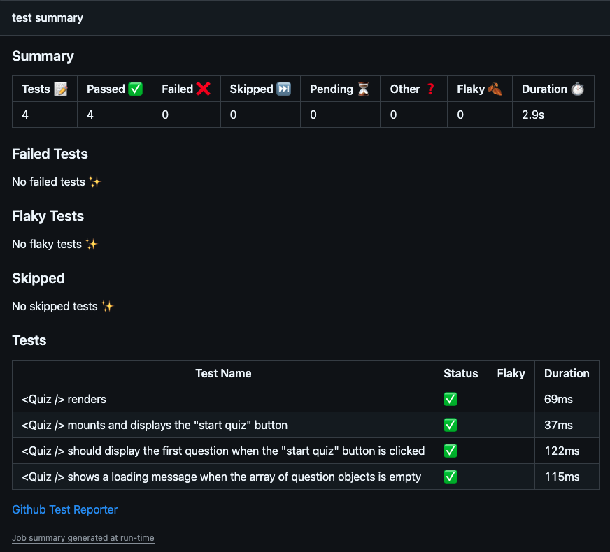

# GitHub Actions CI/CD Setup

                 
## Description

The GitHub Actions CI/CD setup takes an already functioning application, applies Cypress tests, and ensures the Cypress tests are run everytime a merge request is made from the feature to the develop branch. If it passes all the Cypress tests, it will trigger a Deploy hook for Render to deploy the latest version of the code once a merge request is commited to the main branch. 

## Screenshot
  

## Table of Contents
  
- [GitHub Actions CI/CD Setup](#github-actions-cicd-setup)
  - [Description](#description)
  - [Screenshot](#screenshot)
  - [Table of Contents](#table-of-contents)
  - [Installation](#installation)
  - [Usage](#usage)
  - [License](#license)
  - [Contributing](#contributing)
  - [Credits](#credits)
  - [Tests](#tests)
  - [Questions](#questions)
  
## Installation
  
No need to install. To view the tests/checks, explore the merge requests and commits made in this repository. 

To see the deployed application that is deployed on Render, see link: [here](https://github-actions-cicd-setup-f5wx.onrender.com/)
  
## Usage
  
No user-side usage is intended, unless you would like to take the deployed Tech Quiz for yourself, in which case feel free to visit the link. You can also fork this repo to test out the Cypress tests yourself, or create your own!

## License

This project uses MIT License.

Please refer to LICENSE file for more information.

## Contributing
  
No need to contribute, however feel free to fork and make it your own!
  
## Credits
  
Majory of test code written by jsparrowio (Josh Garrett) with assistance by intructors, activities, and the XPert Learning Chatbot from the edX/UofM Coding Bootcamp. Actual application code provided by edX and their respective developers.
  
## Tests
  
To test, follow usage instructions above.
  
## Questions
  
If you have any additional questions, please contact me at:
  
[GitHub](https://www.github.com/jsparrowio)
  
[jsparrowio@outlook.com](mailto:jsparrowio@outlook.com)